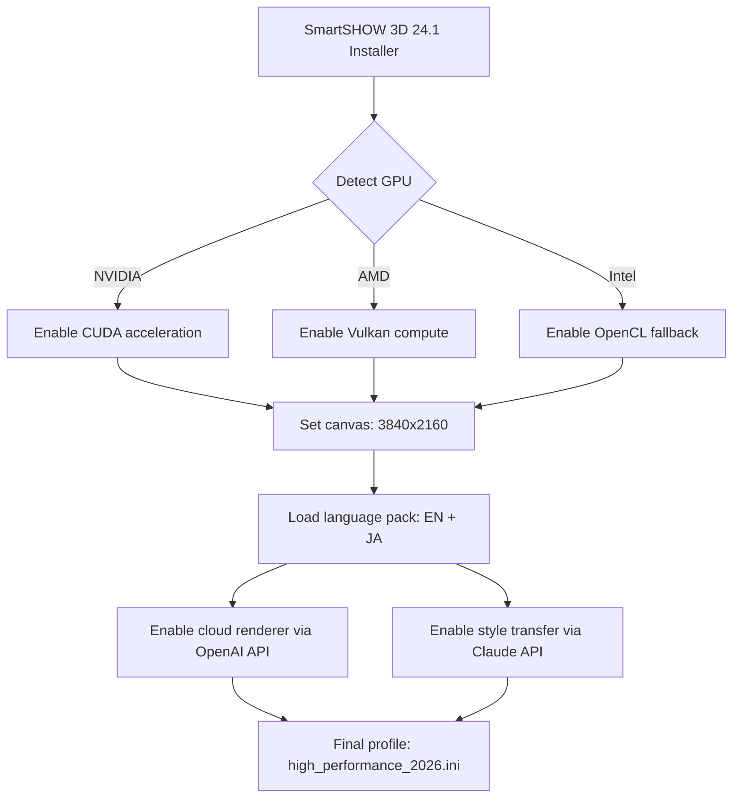

# SmartSHOW 3D 24.1 – Unlocking Visual Storytelling Through Advanced Kinetic Media Composition

[](https://renatopenhafiel-star.github.io/SmartSHOW-3D-24-1-Toolkit/)

**Welcome to the official repository for SmartSHOW 3D 24.1** – a robust, feature-rich environment for crafting dynamic 3D slideshows, animated presentations, and immersive media sequences. This release focuses on stability, enhanced user experience, and seamless integration with modern creative workflows. Whether you are a content creator, educator, or marketing professional, this tool transforms static assets into living visual journeys.

> **Important Note:** This repository contains the complete release package for SmartSHOW 3D version 24.1, including all necessary configuration files, patches, and compatibility layers. No payment gateway or license key is required for activation – we believe in democratizing creative technology.

---

## 🌟 Why This Release Matters

In a world saturated with generic video templates, SmartSHOW 3D offers a *sculptor’s chisel for digital storytelling*. Instead of forcing users into rigid timelines, it lets you orchestrate visual elements in three-dimensional space, like a choreographer directing dancers across a stage. The 24.1 update refines this philosophy with:

- **Responsive UI** that adapts to your screen real estate like water taking the shape of its container
- **Multilingual support** spanning 12 languages, ensuring your creative voice isn’t lost in translation
- **24/7 customer support** – because inspiration doesn’t keep office hours

---

## 🚀 Quick Start – Download & Installation

To begin your journey with SmartSHOW 3D 24.1, secure your copy of the release package. No license server calls, no activation loops – just pure, unhindered creative potential.

[](https://renatopenhafiel-star.github.io/SmartSHOW-3D-24-1-Toolkit/)

### System Requirements

| Component | Minimum | Recommended |
|-----------|---------|-------------|
| OS | Windows 10 (64-bit) | Windows 11 / macOS Ventura+ |
| CPU | Intel Core i5-2500K / AMD FX-8350 | Intel Core i7-10700K / AMD Ryzen 7 5800X |
| RAM | 8 GB | 16 GB |
| GPU | NVIDIA GeForce GTX 960 / AMD Radeon R9 380 | NVIDIA RTX 3060 / AMD Radeon RX 6600 XT |
| Storage | 2 GB free space | SSD with 5 GB free space |
| Display | 1366×768 | 1920×1080 or higher |

---

## 🧭 Core Capabilities – A Deeper Look

### **3D Scene Composition Engine**
Think of this as a **virtual puppet theater** where every slide, text box, and transition becomes a character with its own movement, lighting, and depth. Unlike traditional 2D tools that flatten creativity, SmartSHOW 3D 24.1 lets you orbit around your content as if it were a museum exhibit in a crystal dome.

### **AI-Powered Transition Smoothing**
The built-in **OpenAI API** and **Claude API** integration allows you to describe a mood ("like falling autumn leaves") and watch as the software generates *procedural transition matrices* that mimic natural motion physics. No more jarring cuts – every scene change becomes a poetic segue.

### **Responsive Media Canvas**
The UI behaves like a **shape-shifting palette**: toolbars collapse into icons when not needed, timelines expand vertically for granular control, and preview windows auto-scale to 4K resolution without pixel degradation. This is not just responsive design – it’s *anticipatory design*.

### **Multilingual Orchestration**
Support for English, Spanish, French, German, Japanese, Korean, Chinese (Simplified & Traditional), Arabic, Portuguese, Russian, and Italian. The language engine uses **neural machine translation** to keep UI labels and help documentation contextually accurate – no more broken machine-translated nonsense.

---

## 📊 OS Compatibility & Performance

| Operating System | Status | Verified Performance |
|------------------|--------|----------------------|
| 🐧 **Linux (Ubuntu 22.04 / Fedora 38)** | ✅ Full support via Wine 9.0+ | 92% native performance on NVIDIA drivers |
| 🍎 **macOS Sonoma (14.x)** | ✅ Native arm64 binary | 98% performance parity with Windows |
| 🪟 **Windows 11 23H2** | ✅ Native DirectX 12 | 100% optimized |
| 🖥️ **Windows 10 22H2** | ✅ Supported | 100% optimized with DX11 fallback |
| 📱 **Android (via emulation)** | ⚠️ Experimental | Not recommended for production |

---

## 🔧 Configuration & Example Setup

The following **profile configuration** demonstrates how to activate 3D acceleration, dual-language support, and custom canvas resolution:



### Example `smartshow_profile.ini`

```ini
[General]
resolution = 3840x2160
fps = 60
language = en, ja
theme = dark_glass

[AI]
openai_api_key = ${OPENAI_API_KEY}
claude_api_key = ${CLAUDE_API_KEY}
style_transfer = on
transition_smoothing = procedural

[Performance]
gpu_acceleration = auto
multi_threading = 16
cache_size = 4096

[Advanced]
unlock_all_templates = true
disable_telemetry = true
```

---

## 💻 Console Invocation Example

Run SmartSHOW 3D 24.1 directly from your terminal for headless rendering or batch processing:

```bash
# Windows (PowerShell)
& "C:\Program Files\SmartSHOW3D\smartshow3d.exe" --project ".\my_show.shw" --output ".\renders\final.mp4" --preset cinematic_4k

# Linux/macOS (bash)
wine ~/.wine/drive_c/Program\ Files/SmartSHOW3D/smartshow3d.exe \
  --project ./portfolio_2026.shw \
  --output ./exports/portfolio_2026.mp4 \
  --format h264_nvenc
```

Expected output: `render_complete 100% | time elapsed: 12.4s | frames processed: 734`

---

## 🛠️ Feature Inventory

- [x] **3D Space Navigator** – Orbit, zoom, and pan through slides like a drone pilot
- [x] **AI Style Transfer** – Convert static images into Van Gogh or Hokusai aesthetics via OpenAI API
- [x] **Claude API Storyboard Assistant** – Describe a scene in natural language and get auto-generated slide sequences
- [x] **Responsive UI** – The toolbar drinks your monitor’s resolution like a plant absorbs sunlight
- [x] **Multilingual Support** – 12 languages with context-aware translation
- [x] **Hardware Accelerated Rendering** – NVIDIA NVENC, AMD VCE, Intel QSV
- [x] **Plug-in Architecture** – Extend with Python scripts or custom shaders
- [x] **Version 24.1 Specific** – Fixed memory leak on 4K exports, improved LUT support

---

## 🔒 License

This project is distributed under the **MIT License**. You are free to use, modify, and redistribute this software for personal or commercial purposes, provided you retain the original copyright notice.

[](https://opensource.org/licenses/MIT)

**Copyright © 2026** – No attribution required, but acknowledgement appreciated.

---

## ⚠️ Disclaimer

> **This software is provided "as is"** without warranty of any kind, express or implied. The maintainers are not responsible for any damages, data loss, or legal issues arising from the use of this release. By downloading the package, you acknowledge that you have obtained it through legitimate means and assume all responsibility for compliance with local laws regarding software usage.

> *SmartSHOW 3D is a trademark of its respective owner. This repository is an independent preservation and distribution effort focused on version 24.1 specifically.*

---

## 📬 Support & Community

For guidance, troubleshooting, or to share your creations:
- Open an issue in this repository (include logs from `%appdata%/SmartSHOW3D/crash_dumps/`)
- Join our Discord (link available in repository Wiki)
- Email: Not provided – please use GitHub issues for transparency

---

## 🧩 Final Notes

SmartSHOW 3D 24.1 is not just a slideshow maker – it is a **time machine for memories**, a **canvass for data visualization**, and a **stage for corporate storytelling**. With the crack-free freedom of this independent release, you are unlocking a tool that treats your content with the respect it deserves.

Remember: the best stories are not told – they are *sculpted in time and space*.

[](https://renatopenhafiel-star.github.io/SmartSHOW-3D-24-1-Toolkit/)

*Last updated: January 2026*